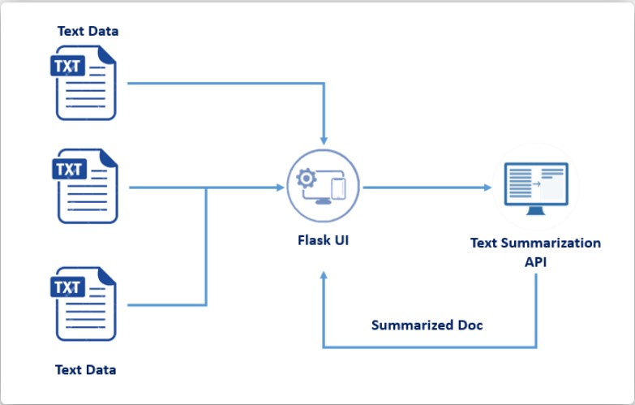

# ARTICLE SUMMARIZER

### OBJECTIVE: To Summarize An Article Using Adaptive Text Summarization API With IBM Cloud

### Project Description:
As the amount of public content increases, so does the difficulty of reading it in a limited span of time.
Moreover, digesting all of this content in a meaningful fashion requires time and effort.
An efficient way of skimming through the content is to read summaries, if available.
This application aims to give you a short summary of a long article by eliminating unnecessary detail and giving you only the important and relevant parts of the article.
The article can be given directly as input or the url to the article can be entered to have it summarized.

### ARCHITECTURE:

